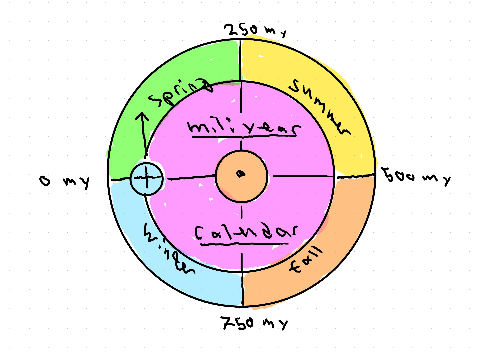

# miliyear calendar system

## the idea
the idea of this project is make an alternative decimal calendar system based on the year as the standard unit instead of the day, so we can use decimal time division without redefining the second or getting out of sync with the solar year.

## definitions
### the miliyear
since the earth rotates about $2 \pi$ radians/solar year, we simplify divide the year into 1000 units, **miliyears**. so each miliyear corresponds to the time taken to rotate $\frac{2\pi}{10^3}$ radians ($1 \text{my} \sim 8.77 h$).

therefore, the main "day-to-day" unit is now 8.77 hours long. we can of course also define the microyear, nanoyear etc., since we are simply treating dates as decimal numbers.

### derived partical calendar units
1000 my divides nicely up in 100 and 10, meaning a redefined month would be 100 my long and a week would be 10 my long., meaning we need ten weekdays and ten months. 

#### months
since it is stupid to start a year in the middle of a season, nobody likes januar and febuary, and starting in march would fix the naming convention, we let the months be the following:

| month      | miliyears |
|------------|--------------------------|
| march      | 000-099                  |
| april      | 100-199                  |
| may        | 200-299                  |
| june       | 300-399                  |
| july       | 400-499                  |
| august     | 500-599                  |
| september  | 600-699                  |
| october    | 700-799                  |
| november   | 800-899                  |
| december   | 900-999                  |

#### days of the week
we will add three weekdays to the existing, following tradition of naming after astronomical objects in the solar system:

- monday (mon)
- tuesday (tue)
- wednesday (wed)
- thursday (thu)
- friday (fri)
- saturday (sat)
- sunday (sun)
- uranday (ura) (alternate form to avoid bad jokes)
- neptuneday (nep)
- plutoday (plu)

(we will refrain from using capital letters for multiple reasons, but mainly to avoid confusion with the old months.)

#### seasons
it naturally follows that spring starts at 0 my, summer at 250 my, fall at 500 my, and winter at 750 my.

# implementation
## goal
the goal is to make a working time server and clock system in practical places to make the miliyear calendar and clock system accessible to use in a world almost entirely using the bad calendar systems.